# Dovelia - App de Intercambio de Casas

Dovelia es una plataforma accesible mediante aplicación móvil que tiene como objetivo el intercambio de viviendas entre propietarios. Frente a las ataduras del mercado inmobiliario actual, Dovelia ofrece una solución que permite a los usuarios viajar y experimentar nuevas ciudades manteniendo la seguridad de su hogar como respaldo. 

## Stack Tecnológico (FrontEnd)

La aplicación ha sido desarrollada siguiendo los estándares modernos de desarrollo Android:
* **Lenguaje y UI:** Kotlin y Jetpack Compose.
* **Diseño Visual:** Material Design 3.
* **Arquitectura:** Modelo-Vista Vista-Modelo (MVVM).
* **Carga de imágenes:** Coil.
* **Peticiones de Red:** Retrofit y OkHttp.
* **Inyección de Dependencias:** Hilt.
* **Animaciones:** Lottie Compose.
* **Seguridad Local:** Jetpack Security Crypto (EncryptedSharedPreferences con cifrado AES-256).

---

# Manual de Uso y Funcionalidades

### 1. Gestión de Usuarios y Autenticación
Los usuarios pueden crear una cuenta o iniciar sesión de forma tradicional (email y contraseña) o a través de su cuenta de Google para agilizar el proceso. El registro está dividido en pasos para recopilar ordenadamente tanto la información del usuario como la de su alojamiento.

| Inicio de Sesión | Registro (Paso 1) | Registro (Paso 2) |
| :---: | :---: | :---: |
| 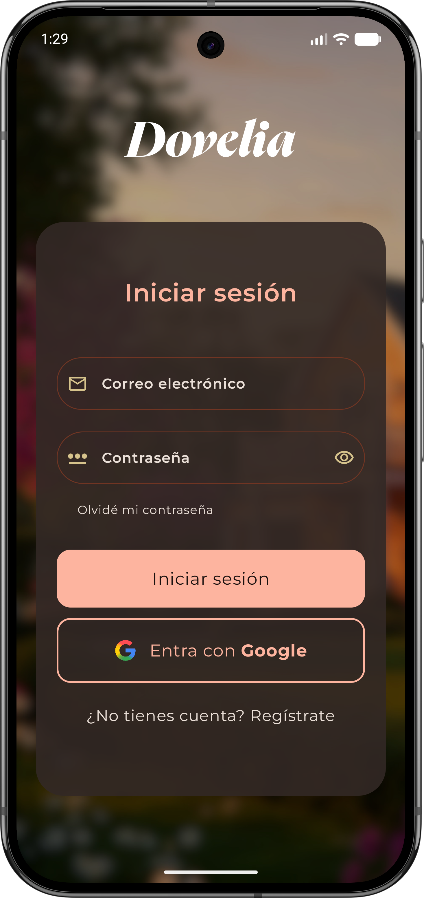 | 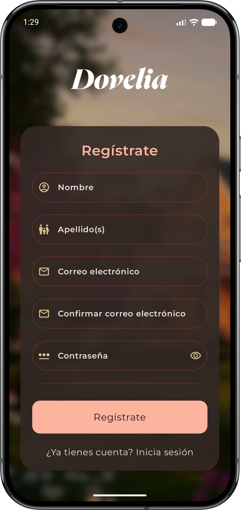 | 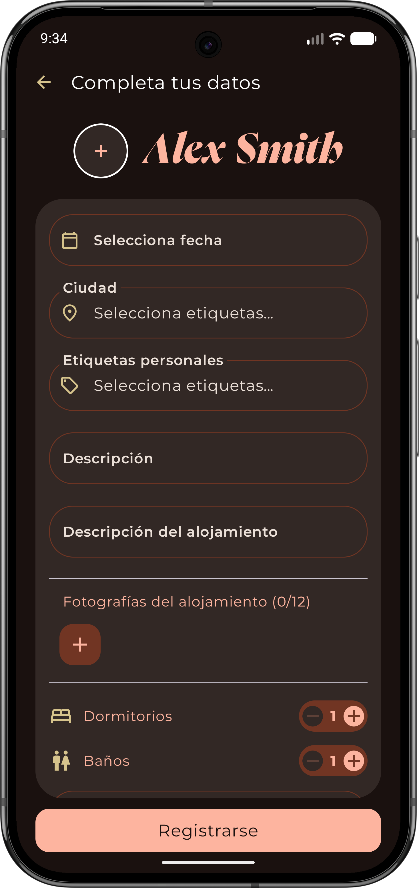 |
| **Pantalla principal** para acceder con correo y contraseña o de forma ágil mediante una cuenta vinculada de Google. | **Primer paso del registro** donde el usuario introduce sus datos personales y establece sus credenciales de acceso. | **Segundo paso** para completar el perfil con detalles personales, descripción y añadir las fotografías del alojamiento. |

### 2. Recuperación de Contraseña
En caso de pérdida, la plataforma cuenta con un flujo de recuperación. El sistema envía un código de seguridad (PIN) al correo electrónico registrado para poder verificar la identidad y establecer una nueva contraseña.

| Solicitar Código | Email de Recuperación | Nueva Contraseña |
| :---: | :---: | :---: |
| 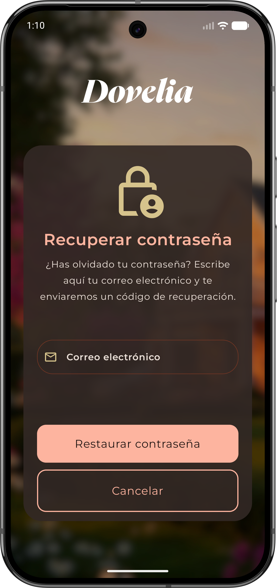 | 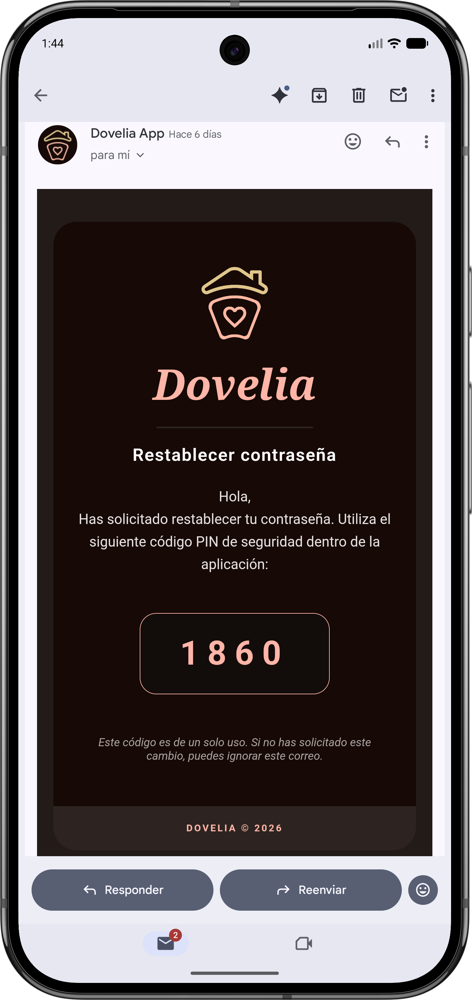 |  |
| **Paso 1:** Pantalla donde el usuario introduce su correo electrónico para solicitar el PIN de seguridad al servidor. | **Correo automático:** Ejemplo del email enviado por el soporte de la plataforma con el PIN de 4 dígitos. | **Paso 2:** Pantalla para introducir el código recibido por email y validar el cambio a una nueva contraseña segura. |

### 3. Descubrir y Sistema de Swipes
El corazón de Dovelia. Los usuarios exploran alojamientos mediante un sistema de tarjetas interactivas. Se pueden aplicar filtros para afinar la búsqueda y visualizar el perfil completo de cualquier usuario antes de tomar una decisión.

| Tarjeta Discover | Swipe "No me gusta" | Swipe "Me gusta" |
| :---: | :---: | :---: |
| 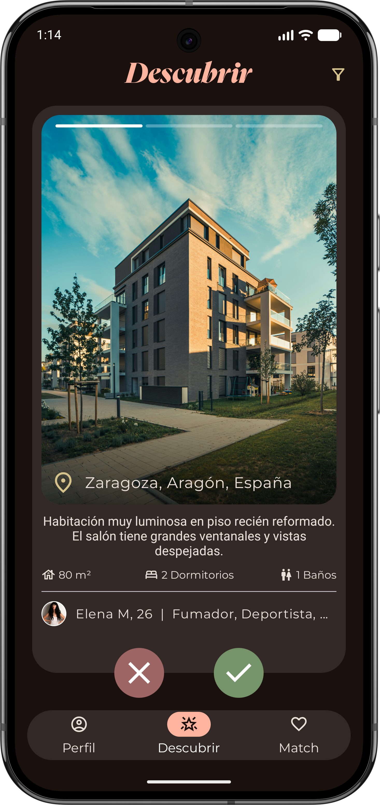 |  |  |
| **Interfaz principal.** Muestra tarjetas con la galería de fotos interactiva, ciudad, etiquetas y datos básicos del alojamiento. | **Deslizar a la izquierda** (o pulsar la X roja) para descartar un perfil que no encaja con las preferencias. | **Deslizar a la derecha** (o pulsar el tick verde) para indicar interés en el alojamiento. Si es mutuo, hay Match |

| Filtros de Búsqueda | Perfil de otro usuario |
| :---: | :---: |
| 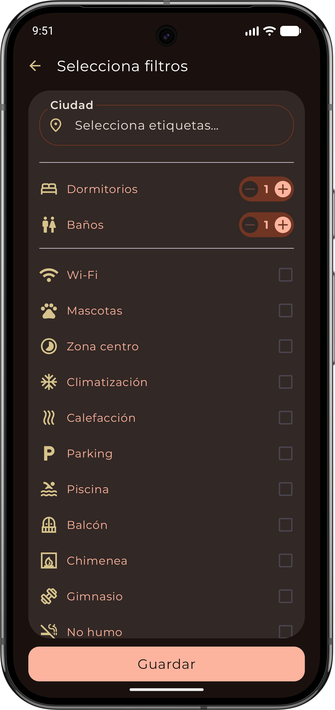 | 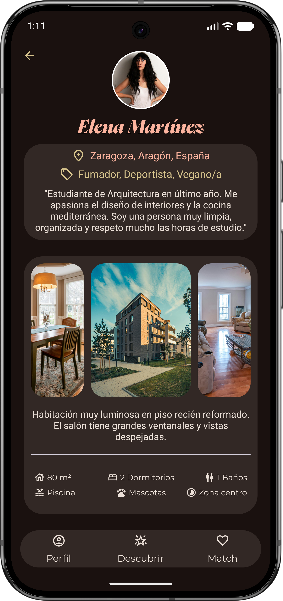 |
| **Panel de filtros** para ajustar la búsqueda seleccionando una ciudad destino, número de habitaciones, baños y comodidades. | **Vista detallada** del perfil de otro usuario, muestra su descripción completa y galería. |

### 4. Interacción y Chat Interno
Cuando dos usuarios se dan "Me gusta" mutuamente, se produce un Match. Estos perfiles pasan a la lista de coincidencias, desde donde es posible abrir un chat en tiempo real para organizar los detalles del intercambio.

| Lista de Matches | Chat en Tiempo Real |
| :---: | :---: |
| 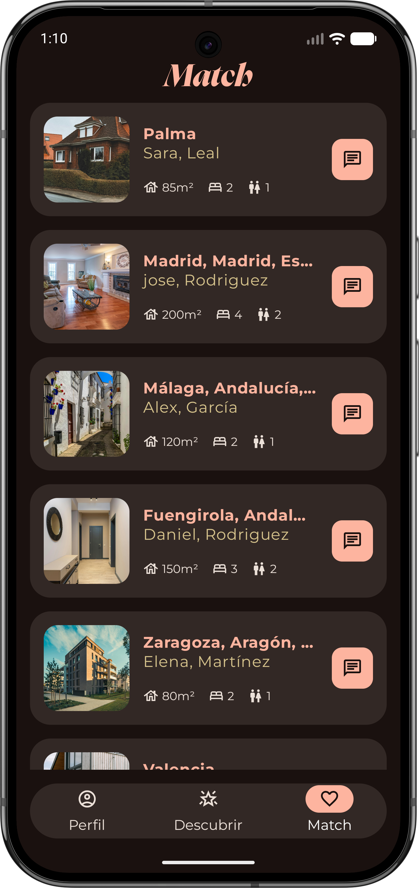 | 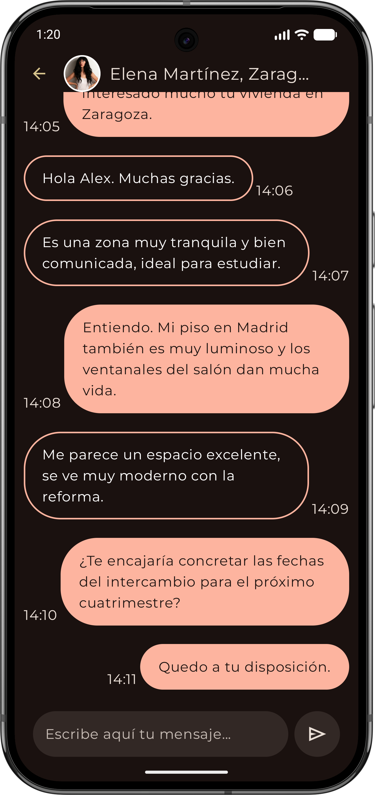 |
| **Listado de usuarios** con los que existe un interés mutuo, con accesos directos para ver el perfil o iniciar una conversación. | **Mensajería integrada** impulsada por WebSockets para organizar el intercambio sin salir de la plataforma. |

### 5. Gestión del Perfil Propio y Configuración
El usuario tiene control total sobre su cuenta, pudiendo editar la información pública de su perfil, cerrar sesión de forma segura y consultar la información de la App.

| Perfil Propio | Editar Perfil | Cerrar Sesión / Info |
| :---: | :---: | :---: |
| 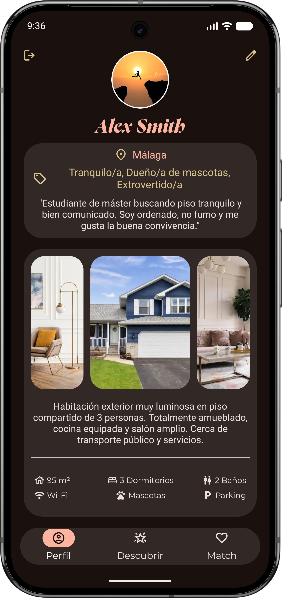 | 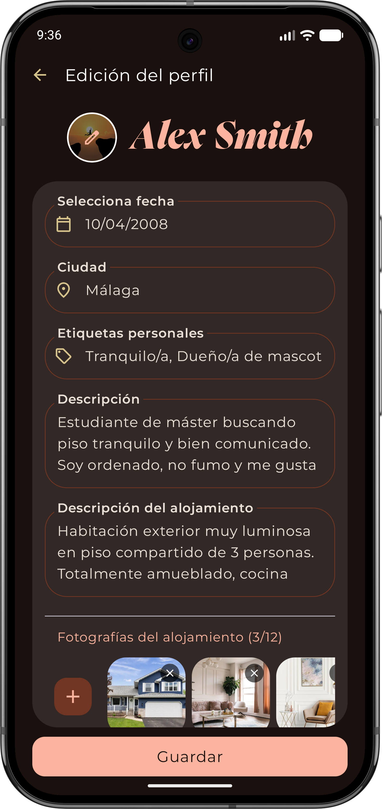 | 
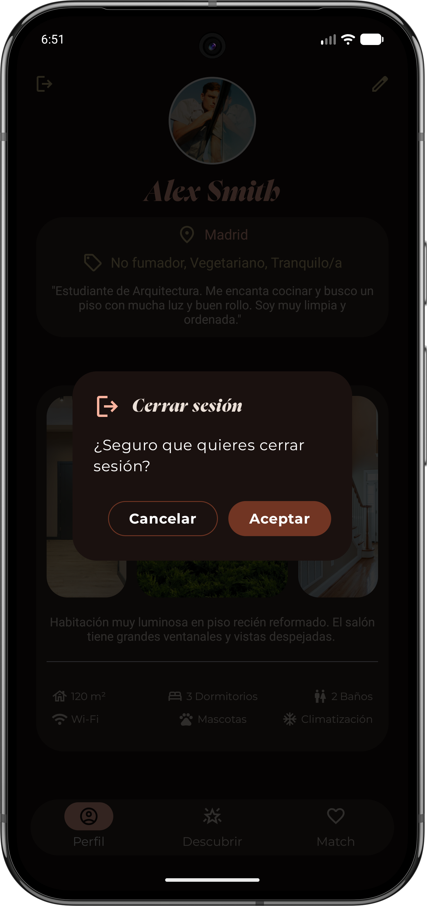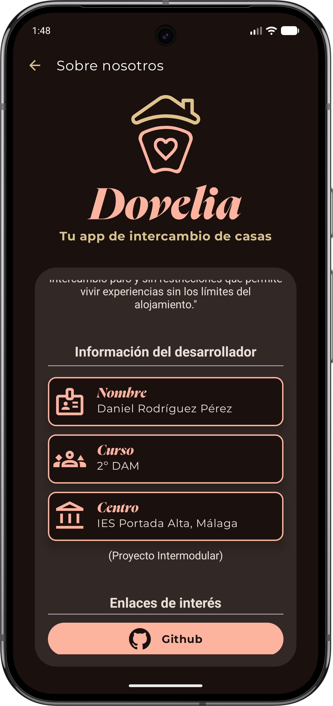
 |
| **Vista del perfil propio**, mostrando exactamente cómo verán el perfil y el alojamiento el resto de miembros en la app. | **Formulario de edición** para modificar la información pública, actualizar fotos o cambiar las características del piso. | **Avisos y About Us:** Diálogo de seguridad para cerrar la sesión actual y pantalla informativa sobre el proyecto y el desarrollador. |

---

*Proyecto Integrado desarrollado por Daniel Rodríguez Pérez.*
*2º GS DAM - IES Portada Alta*
